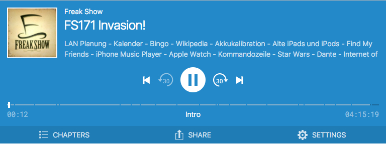

# Podlove Web Player

## About

HTML5 Goodness for Podcasting

**Podlove** Web Player is a Podcast-optimized, HTML5-based video and audio player.
It can be used as a WordPress plugin or within a static HTML/JavaScript context.

The **Podlove** Web Player supports almost every modern browser and also does captions, chapters and much more.
Thanks to Howler.js for providing the foundation.

* [Web Player Documentation](http://docs.podlove.org/podlove-web-player/)
* [Web Player Wiki](https://github.com/podlove/podlove-web-player/wiki)
* [Official site on podlove.org](http://podlove.org/podlove-web-player/)
* [WordPress Plugin Page](http://wordpress.org/plugins/podlove-web-player/)

## Used Technologies

- Package Manager: [Yarn](https://github.com/yarnpkg/yarn)
- Media Library: [Howler](https://github.com/goldfire/howler.js/)
- View Renderer: [VueJS](https://github.com/vuejs/vue)
- Bundler: [Webpack](https://github.com/webpack/webpack)
- State Management: [Redux](https://github.com/reactjs/redux)

## Development

### Setup

Clone the repository and install all dependencies with `yarn`

### Local Development

1. Run `yarn dev`
2. Access `http://localhost:8080/standalone.html` for development

### Tests

1. Run `yarn test` for test suite
2. or `yarn test:dev` for interactive mode

### Build

1. Run `yarn build`
2. Locate build artefacts in `dist/`

### Join the conversation

Become a part of the
* **Podlove community** [community.podlove.org](https://community.podlove.org/), or discuss your
* **Web Player** topics or questions on [community.podlove.org/c/podlove-web-player](https://community.podlove.org/c/podlove-web-player).

If you're interested in discussing podcasting topics in general, please visit [sendegate.de](https://sendegate.de/).

### Podlove Docs

* **Podlove Project:** [podlove.github.com](http://podlove.github.com)
* **Web Player:** [docs.podlove.org/podlove-web-player](http://docs.podlove.org/podlove-web-player/)

### Report an issue
If you encounter a specific problem using the Podlove Web Player that you think is a bug, or you see a problem in the documentation, you can report the issue here: 
[github.com/podlove/podlove-web-player/issues](https://github.com/podlove/podlove-web-player/issues)

Also, if you have ideas for new features for player, please submit them as a [Github issue](https://github.com/podlove/podlove-web-player/issues).

Have a look on the Trello board to watch the status and progress of your issues: 
[trello.com/b/mFPdgi1P/podlove-web-player](https://trello.com/b/mFPdgi1P/podlove-web-player)

### Update the documentation
For contributing to Podlove Web Player documentation, see: 
[github.com/podlove/podlove.github.com](https://github.com/podlove/podlove.github.com)
